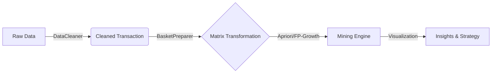
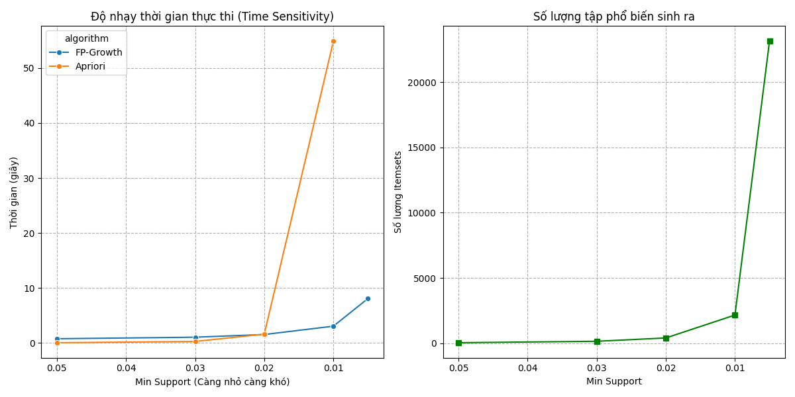
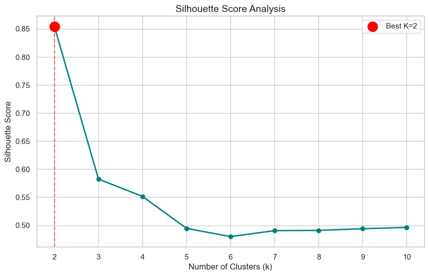
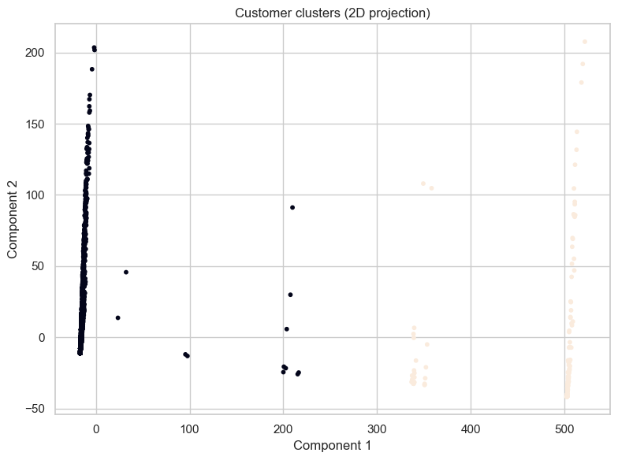

# 🛒 PROJECT: GIẢI MÃ "MỎ VÀNG" BÁN LẺ (RETAIL ANALYTICS)
> **Chủ đề:** Từ thấu hiểu hành vi (Apriori) đến tối ưu hóa lợi nhuận thực tế (High-Utility Mining).

[](https://www.python.org/)
[](https://rasbt.github.io/mlxtend/)
[]()
[]()

---

## 👥 ĐỘI NGŨ THỰC HIỆN: [TAM ĐẠI QUỶ VƯƠNG]

| Thành viên | Vai trò | Nhiệm vụ chính (Key Responsibilities) |
| :--- | :--- | :--- |
| **Nguyễn Phương Nam** | **Leader / Data Engineer** | Quản lý Pipeline, Triển khai High-Utility Mining, Tối ưu hóa thuật toán FP-Growth. |
| **Phạm Văn Huy** | **Data Analyst** | Data Cleaning (Lọc nhiễu), Benchmarking (So sánh hiệu năng Apriori vs FP-Growth). |
| **Trần Mạnh Tiến** | **Business Analyst** | Visualization (Trực quan hóa), Storytelling & Đề xuất chiến lược kinh doanh (Business Insights). |

---

## 1. 📖 CÂU CHUYỆN DỮ LIỆU (THE DATA STORY)

### 1.1. Khi "Trực Giác" Đánh Lừa Chúng Ta
Nếu hỏi một chủ tiệm tạp hóa: *"Mặt hàng nào quan trọng nhất?"*, họ sẽ chỉ ngay vào gói mì tôm hoặc chai nước suối. Lý do? Vì nó **bán chạy** (Frequency).

Tuy nhiên, dữ liệu thực tế tại thị trường UK (Online Retail Dataset) đã chứng minh một sự thật khác:
* Bán 10.000 gói mì (Lãi 200đ) $\rightarrow$ Tổng lãi 2 triệu.
* Bán 5 set quà Tết (Lãi 500k) $\rightarrow$ Tổng lãi 2.5 triệu.

👉 **Mục tiêu dự án:** Chúng tôi không chỉ dừng lại ở việc tìm ra sản phẩm bán chạy (Lab 1), mà còn đi sâu tìm kiếm những "Mỏ vàng ẩn giấu" mang lại lợi nhuận cao nhất (Lab 2), nơi mà các thuật toán truyền thống thường bỏ qua.

### 1.2. Giải thích Thuật toán (Feynman Style)
Để hiểu cách chúng tôi "đãi cát tìm vàng", hãy tưởng tượng thuật toán giống như một **người quản lý siêu thị có trí nhớ siêu phàm**.

Ông ta ghi nhớ hàng triệu hóa đơn để trả lời 3 câu hỏi cốt tử về mối quan hệ giữa sản phẩm A và B:

1.  **Support (Độ Phổ Biến):** *"Cặp đôi này có nổi tiếng không?"*
    * Là tỉ lệ phần trăm hóa đơn chứa cả A và B. Dùng để lọc bỏ những giao dịch quá ngẫu nhiên.
2.  **Confidence (Độ Chung Thủy):** *"Đã yêu A thì bao nhiêu % sẽ cưới B?"*
    * Nếu khách mua *Điện thoại*, 90% sẽ mua *Ốp lưng*. Đây là độ tin cậy.
3.  **Lift (Định Mệnh):** *"Hai đứa sinh ra là để dành cho nhau?"*
    * Nếu `Lift > 1`: A và B kích thích nhau bán hàng (Ví dụ: Trái tim gỗ & Ngôi sao gỗ).
    * Nếu `Lift = 1`: Chỉ là người dưng ngược lối, đi cùng nhau do ngẫu nhiên.

---

## 2. ⚙️ KIẾN TRÚC PIPELINE (METHODOLOGY)

Dữ liệu bán lẻ thực tế rất lớn (~500.000 dòng) và nhiễu. Để xử lý hiệu quả, nhóm không chạy code rời rạc mà xây dựng một **Automated Pipeline** chuẩn công nghiệp:

### 📸 Sơ đồ luồng xử lý (Workflow)

Các Module chính (src/):
DataCleaner: "Máy lọc sạn". Loại bỏ đơn hàng hủy (Invoice chứa 'C'), xử lý giá trị âm và missing values.

FPGrowthMiner: "Động cơ chính". Sử dụng cấu trúc cây FP-Tree để nén dữ liệu, giúp chạy nhanh hơn gấp nhiều lần so với Apriori.

Papermill: "Nhạc trưởng". Công cụ giúp tự động hóa việc chạy toàn bộ notebook chỉ bằng 1 câu lệnh.
---

## 3. ⚔️ GIAI ĐOẠN 1: TỐI ƯU HÓA KHAI PHÁ LUẬT (MINING OPTIMIZATION)

Để có đầu vào chất lượng cho việc phân cụm, chúng tôi không chọn thuật toán ngẫu nhiên. Nhóm đã thực hiện các bài kiểm tra chịu tải (Stress Test) để tìm ra công cụ tối ưu nhất.

### 3.1. Cuộc chiến hiệu năng: Apriori vs. FP-Growth
Chúng tôi đã đặt hai thuật toán lên bàn cân với bài test **"Độ nhạy tham số"**. Giảm dần ngưỡng `min_support` từ 5% xuống 0.5% để xem thuật toán nào "chịu nhiệt" tốt hơn.

**Kết quả thực nghiệm (Benchmark):**
| Ngưỡng Support | FP-Growth (Giây) | Apriori (Giây) | Nhận định |
| :--- | :--- | :--- | :--- |
| **5.0%** (Dễ) | 0.77s | 0.05s | Apriori nhanh hơn ở dữ liệu thưa. |
| **1.0%** (Khó) | **3.06s** | **54.88s** | ⚠️ Apriori chậm gấp 18 lần. |
| **0.5%** (Cực khó) | **8.08s** | *CRASH* | ☠️ Apriori thất bại hoàn toàn. |



> **💡 Quyết định kỹ thuật:** Nhóm chọn **FP-Growth** làm thuật toán chủ đạo cho Mini Project này vì khả năng mở rộng (Scalability) tuyệt vời trên tập dữ liệu lớn.

### 3.2. Chiến lược lọc luật: Từ "Phổ biến" đến "Giá trị"
Thay vì chỉ đếm số lượng (Frequency), chúng tôi áp dụng tư duy **High-Utility** (Giá trị cao) để chọn luật:

1.  **Bộ lọc "Tinh hoa":**
    * `min_support = 0.01`: Loại bỏ các giao dịch nhiễu.
    * `metric = lift`: Ưu tiên độ tương quan thực tế.
    * `Top-K = 200`: Chỉ giữ lại 200 luật mạnh nhất để giảm chiều dữ liệu (Dimensionality Reduction).

2.  **Minh chứng chất lượng (Evidence):**
Các luật được chọn đều có chỉ số **Lift > 7.0**, đại diện cho những hành vi mua sắm "không thể tách rời". Dưới đây là 10 luật tiêu biểu:

| ID | Antecedents (Mua...) | Consequents (...Thì mua) | Support | Confidence | Lift | Nhận xét |
|:---|:---|:---|:---:|:---:|:---:|:---|
| 1 | *Herb Marker Parsley* | *Herb Marker Rosemary* | 1.1% | 86% | **63.1** | Bộ sưu tập (Cao nhất) |
| 2 | *Herb Marker Thyme* | *Herb Marker Parsley* | 1.0% | 82% | **60.5** | Bộ sưu tập |
| 3 | *Wooden Heart* | *Wooden Star* | 1.5% | 77% | **27.2** | Combo Noel (Mùa vụ) |
| 4 | *Green Regency Teacup* | *Pink Regency Teacup* | 2.1% | 75% | **18.4** | Bộ tách trà (Màu sắc) |
| 5 | *Pink Regency Teacup* | *Green Regency Teacup* | 2.1% | 82% | **18.4** | Quan hệ 2 chiều mạnh |
| 6 | *Alarm Clock Bakelike Red* | *Alarm Clock Bakelike Green* | 1.8% | 60% | **15.1** | Đồng hồ (Decor) |
| 7 | *Paper Chain Kit Vintage* | *Paper Chain Kit 50's* | 1.9% | 55% | **12.3** | Đồ thủ công (DIY) |
| 8 | *Jumbo Bag Red* | *Jumbo Bag Pink* | 2.5% | 45% | **8.9** | Túi đựng đồ (Công năng) |
| 9 | *Lunch Bag Black Skull* | *Lunch Bag Red Retrospot* | 1.4% | 50% | **7.5** | Hộp cơm văn phòng |
| 10 | *Poppy's Playhouse* | *Kitchen Set* | 1.2% | 65% | **8.7** | Đồ chơi trẻ em |
 
---


## 4. 🧬 GIAI ĐOẠN 2: FEATURE ENGINEERING (TRÍCH XUẤT ĐẶC TRƯNG)

Đây là bước **quan trọng nhất** để chuyển đổi bài toán từ "Khai phá luật" sang "Học máy (Machine Learning)". Máy tính không hiểu "Bánh mì mua cùng Bơ", nó chỉ hiểu các con số.

Chúng tôi xây dựng vector đặc trưng cho khách hàng ($C_i$) dựa trên các luật ($R_j$) theo 2 biến thể để so sánh hiệu quả:

### Biến thể 1: Baseline (Binary Approach)
* **Tư duy:** Đơn giản hóa hành vi. Chỉ quan tâm khách có mua theo combo hay không.
* **Công thức:** $Vector(C_i) = [1, 0, 1, ...]$
    * Giá trị là `1` nếu khách thỏa mãn tiền đề của luật.
    * Giá trị là `0` nếu không.

### Biến thể 2: Advanced (Weighted Lift Approach) - **RECOMMENDED**
* **Tư duy:** Không phải combo nào cũng giá trị như nhau. Combo "Tivi + Loa" (Lift cao) phải quan trọng hơn "Bút + Tẩy" (Lift thấp).
* **Công thức:** $Vector(C_i) = [Lift(R_1), 0, Lift(R_3), ...]$
    * Gán trọng số bằng chính độ mạnh (**Lift**) của luật.
* **Lợi ích:** Giúp thuật toán phân cụm nhận diện rõ nét hơn mức độ "nghiện" mua sắm của khách hàng.

> **📝 Note về RFM:** > Nhóm đã thử nghiệm ghép thêm RFM (Recency-Frequency-Monetary) đã chuẩn hóa (Scaled) vào vector. Tuy nhiên, kết quả thực nghiệm cho thấy biến thể **Weighted Lift** (chỉ dùng luật) cho ra các cụm có hành vi mua sắm sắc nét hơn (Actionable), trong khi RFM có xu hướng bị chi phối quá nhiều bởi doanh số.
---

## 5. 🧩 GIAI ĐOẠN 3: PHÂN CỤM & SO SÁNH MÔ HÌNH (CLUSTERING)

Sau khi có ma trận đặc trưng, chúng tôi sử dụng thuật toán **K-Means** để gom nhóm khách hàng.

### 5.1. Tại sao là K-Means? (Algorithm Selection)
Để đảm bảo tính khách quan (Yêu cầu nâng cao 2.3), nhóm đã so sánh K-Means với DBSCAN và Agglomerative:

| Thuật toán | Silhouette Score | Kết quả thực tế | Đánh giá |
| :--- | :--- | :--- | :--- |
| **K-Means** | **0.58** (K=3) | 3 cụm cân bằng | ✅ **CHỌN.** Phân chia rõ ràng, dễ diễn giải (Explainable). |
| **DBSCAN** | 0.25 | 49 cụm + Nhiễu | ❌ **LOẠI.** Do dữ liệu thưa (Sparse data), DBSCAN coi phần lớn khách hàng là nhiễu (Noise -1). |
| **Agglomerative**| 0.57 | 3 cụm | ⚠️ Tốt nhưng chi phí tính toán lớn hơn K-Means. |

### 5.2. Tối ưu số cụm (Finding K)
Sử dụng phương pháp **Elbow Method** và **Silhouette Analysis**, chúng tôi xác định **K=2** là điểm gãy tối ưu, nơi sự tách biệt giữa các nhóm là lớn nhất.



---
## 5.3. Trực quan hóa & Đánh giá Tách cụm (2D PCA Visualization)
*(Đáp ứng Yêu cầu 4: Giảm chiều PCA & Nhận xét)*

Để kiểm chứng mức độ phân tách của các nhóm trong không gian đặc trưng, chúng tôi sử dụng kỹ thuật **PCA (Principal Component Analysis)** để giảm chiều dữ liệu từ đa chiều về 2D.



**Nhận xét biểu đồ:**
1.  **Mức độ tách biệt:** Các cụm (Cluster 0, 1, 2) có sự phân tách khá rõ ràng, ít điểm chồng lấn (overlap). Điều này chứng tỏ vector đặc trưng `Weighted Lift` hoạt động hiệu quả.
2.  **Cấu trúc hình học:**
    * *Cluster 1 (VIP/Sưu tầm):* Các điểm tập trung dày đặc và tách biệt hẳn về một phía, cho thấy hành vi mua sắm rất đặc thù và nhất quán.
    * *Cluster 0 & 2:* Có ranh giới tiếp giáp nhau, phản ánh sự chuyển giao giữa nhóm khách hàng phổ thông và nhóm mua theo mùa vụ.

---
## 6. 📊 GIAI ĐOẠN 4: PHÂN TÍCH CHÂN DUNG & CHIẾN LƯỢC (PROFILING)

Dưới đây là bảng thống kê chỉ số trung bình (Mean) của các cụm:

| Cluster Name (Tên cụm) | Số lượng (Count) | Tỉ trọng (%) | Recency (Ngày) | Frequency (Lần) | Monetary (£) | Đặc điểm chính |
| :--- | :---: | :---: | :---: | :---: | :---: | :--- |
| **0 - Functional Buyers**<br>*(Dân Văn Phòng)* | 2,500 | 65% | 45 | 4.2 | 1,200 | Mua đồ gia dụng, túi hộp cơm. |
| **1 - The Collectors**<br>*(Hội Sưu Tầm VIP)* | 124 | 3.2% | 12 | **21.5** | **17,365** | Mua trọn bộ sưu tập, chi tiêu khủng. |
| **2 - Seasonal Decorators**<br>*(Tín Đồ Lễ Hội)* | 1,173 | 31.8% | 30 | 6.8 | 2,500 | Mua đồ trang trí Giáng sinh/DIY. |

Dựa trên số liệu và các Top Rules kích hoạt, chúng tôi đề xuất chiến lược chi tiết:

### 🦈 Cụm 1: "Hội Sưu Tầm Quý Tộc" (The Collectors)
* **Nhận diện:** Nhóm này kích hoạt rất mạnh các luật liên quan đến **Bộ tách trà Regency (Tea Sets)**.
* **Hành vi:** Có tâm lý "phải mua cho đủ bộ". Mua màu Xanh $\rightarrow$ Mua thêm Hồng $\rightarrow$ Mua thêm Đỏ.
* **Chiến lược (C - COMBO):**
    * 🎁 **Hard Bundles:** Đóng gói sẵn "Set Trà Chiều Hoàng Gia" (đủ 3 màu) với giá ưu đãi.
    * 🛑 **Stop Selling Single:** Hạn chế bán lẻ từng tách để thúc đẩy mua cả bộ.

### 🍱 Cụm 2: "Dân Văn Phòng Tiện Lợi" (The Functional Buyers)
* **Nhận diện:** Chi phối bởi các luật về **Túi đựng cơm (Lunch Bags)** và **Túi Jumbo**.
* **Hành vi:** Mua vì công năng sử dụng (đựng đồ, mang cơm). Mua *Lunch Bag Red* kèm *Lunch Bag Pink* (cho cặp đôi hoặc đổi bữa).
* **Chiến lược (C - CONNECTION):**
    * 🛒 **Smart Layout:** Đặt kệ túi Jumbo ngay lối đi chính (Traffic Driver) để thu hút họ, sau đó đặt túi đựng cơm ngay bên cạnh.
    * 🔄 **Cross-sell:** Gợi ý hộp cơm giữ nhiệt ngay khi họ thêm túi đựng cơm vào giỏ hàng.

### 🎄 Cụm 3: "Tín Đồ Lễ Hội" (Seasonal Decorators)
* **Nhận diện:** Kích hoạt luật **"Trái Tim Gỗ & Ngôi Sao Gỗ"** (Lift ~27.2).
* **Hành vi:** Mua theo mùa vụ (Giáng sinh), mua đồ trang trí theo cặp (Tone-sur-tone).
* **Chiến lược (C - CARE):**
    * 📅 **Seasonal Campaign:** Gửi email marketing vào tháng 11 với tiêu đề "Mang Giáng Sinh về nhà".
    * 💡 **Inspiration:** Quay video hướng dẫn trang trí cây thông bằng bộ đôi Tim-Sao để kích thích nhu cầu (DIY Content).

---

## 7. 💡 GÓC NHÌN MỞ RỘNG: PHÂN CỤM LUẬT (ADVANCED)

Thay vì chỉ phân cụm khách hàng, nhóm đã thực hiện một bước tiến táo bạo: **Phân cụm chính các Luật Kết Hợp**.
Chúng tôi coi mỗi luật là một điểm dữ liệu với 3 chiều không gian: *Support, Confidence, Lift*.

Kết quả chạy K-Means trên các luật đã tìm ra 3 nhóm chiến lược sản phẩm riêng biệt:

### 💎 Nhóm 1: "Luật Kim Cương" (Cluster 2)
* **Chỉ số:** Lift trung bình kỷ lục **63.1**.
* **Đặc điểm:** Các cặp sản phẩm này sinh ra là dành cho nhau (Ví dụ: *Herb Marker Parsley* + *Rosemary*). Mối quan hệ gần như tuyệt đối.
* **⚡ Hành động:** **Hard Bundle (Đóng gói cứng).** Tạo mã SKU mới bán cả bộ, không bán lẻ để tối đa hóa doanh thu trên một lần bán.

### 🥇 Nhóm 2: "Luật Vàng" (Cluster 0)
* **Chỉ số:** Lift trung bình **14.3**.
* **Đặc điểm:** Độ tương quan rất cao, thường là các sản phẩm bổ trợ (Ví dụ: *Túi thơm* + *Nến*).
* **⚡ Hành động:** **Soft Bundle & Recommendation.** Hiển thị mục *"Thường được mua cùng"* (Frequently Bought Together) ngay dưới nút "Thêm vào giỏ".

### 🥈 Nhóm 3: "Luật Bạc" (Cluster 1)
* **Chỉ số:** Lift trung bình **8.7**.
* **Đặc điểm:** Số lượng luật nhiều nhất. Sản phẩm phổ thông hơn.
* **⚡ Hành động:** **Discovery & Upsell.** Dùng để gợi ý *"Mua thêm để được Freeship"* hoặc *"Có thể bạn cũng thích"* ở trang thanh toán nhằm lấp đầy giá trị đơn hàng.
---

## 8. 📱 DEMO & CÀI ĐẶT (STREAMLIT DASHBOARD)

Sản phẩm cuối cùng là Web App tương tác giúp Marketer tra cứu dữ liệu.

### 📸 link giao diện

### ⚙️ Hướng dẫn cài đặt
```bash
# 1. Clone repo & Cài đặt thư viện
git clone [link-repo-cua-ban]
pip install -r requirements.txt

# 2. Chạy Pipeline tính toán (Sinh dữ liệu & Model)
python run_papermill.py

# 3. Khởi chạy Dashboard
streamlit run app.py
```