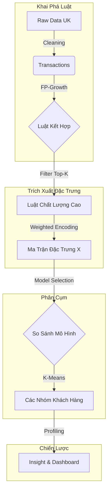

# 📦 PROJECT: HYBRID CUSTOMER SEGMENTATION PIPELINE
> **Chủ đề:** Giải mã "ADN Mua Sắm" - Kết hợp Luật Kết Hợp (Association Rules) & Phân Cụm (Clustering) để tối ưu chiến lược Cross-sell.

[](https://www.python.org/)
[](https://scikit-learn.org/)
[](https://streamlit.io/)
[]()

---

## 👥 ĐỘI NGŨ THỰC HIỆN: [TAM ĐẠI QUỶ VƯƠNG]

| Thành viên | Vai trò (Role) | Trách nhiệm chính (Responsibilities) |
| :--- | :--- | :--- |
| **Nguyễn Phương Nam** | **Data Engineer** | Xây dựng Pipeline, Tiền xử lý dữ liệu (Preprocessing), Tinh chỉnh tham số FP-Growth. |
| **Trần Mạnh Tiến** | **Data Scientist** | Feature Engineering (Trích xuất đặc trưng), Huấn luyện mô hình (K-Means/DBSCAN), Đánh giá mô hình. |
| **Phạm Văn Huy** | **Business Analyst** | Storytelling, Trực quan hóa dữ liệu (Visualization), Xây dựng Dashboard & Chiến lược kinh doanh. |

---

## 1. 📖 TỔNG QUAN & MỤC TIÊU (PROJECT OVERVIEW)

### 1.1. Đặt vấn đề: Khi "Trái Tim Gỗ" và "Ngôi Sao" là định mệnh
Trong bán lẻ hiện đại, việc hiểu khách hàng qua nhân khẩu học (tuổi, giới tính) hay RFM (tiền nong) là chưa đủ. Chúng ta cần hiểu **"Họ mua cái gì cùng nhau?"**.

> **Feynman Style - Giải thích cho "Bà Ngoại" nghe:**
> Hãy tưởng tượng hệ thống này giống như một **người quản lý siêu thị có trí nhớ siêu phàm**. Thay vì đoán mò, ông ta ghi nhớ hàng triệu hóa đơn để tìm ra quy luật:
> *"Cứ hễ ai mua 'Trái Tim Gỗ' thì 80% sẽ mua thêm 'Ngôi Sao Gỗ'."*
>
> Tuy nhiên, biết luật thôi chưa đủ. Ông ta còn muốn biết **"Ai là người hay mua theo luật này?"**.
> - Có người chỉ mua Trái Tim Gỗ (Khách vãng lai).
> - Có người luôn mua cả Tim + Sao + Nến (Khách "nghiện" sưu tập).
>
> **👉 Sứ mệnh:** Dự án này không chỉ tìm ra các cặp đôi sản phẩm, mà còn dùng chính các cặp đôi đó để phân loại khách hàng, từ đó bán đúng cái họ cần.

### 1.2. Khung Năng Lực & Mục Tiêu Đào Tạo (Learning Objectives)
Dự án này được thiết kế để sinh viên (và người đọc) đạt được các cột mốc kiến thức sau:

**🧠 Kiến thức (Knowledge):**
1.  **Hiểu quy trình Hybrid:** Nắm vững cách kết hợp giữa *Khai phá luật (Unsupervised)* và *Phân cụm (Clustering)*.
2.  **Feature Engineering:** Học cách chuyển đổi dữ liệu dạng giao dịch (Transaction) sang dạng vector đặc trưng (Feature Vector) để máy học hiểu được.
3.  **Model Evaluation:** Hiểu cách dùng các chỉ số định lượng (Silhouette, Elbow) để đánh giá chất lượng phân cụm thay vì cảm tính.

**🛠️ Kỹ năng (Skills):**
1.  **Trích xuất đặc trưng (Feature Extraction):** Xây dựng ma trận đặc trưng từ luật kết hợp (Lift-based weighting).
2.  **Phân cụm nâng cao:** Áp dụng và so sánh các thuật toán KMeans, Agglomerative, DBSCAN.
3.  **Business Intelligence:** Diễn giải các con số khô khan thành chiến lược hành động (Actionable Insights).

---

## 2. ⚙️ QUY TRÌNH KỸ THUẬT (PIPELINE ARCHITECTURE)

Chúng tôi xây dựng một **End-to-End Pipeline** khép kín gồm 4 giai đoạn chính:


Chi tiết các bước thực hiện:
Tiền xử lý & Khai phá: Tái sử dụng module Apriori/FP-Growth để tìm ra các luật có Lift cao và Support đủ mạnh.

Trích xuất đặc trưng (Feature Extraction): Xây dựng vector cho từng khách hàng. Mỗi chiều không gian đại diện cho một luật mua sắm.

Gán nhãn: Sử dụng trọng số Lift thay vì nhị phân 0/1 để phản ánh mức độ quan tâm.

Phân cụm (Clustering): Sử dụng K-Means để gom nhóm. Tối ưu số cụm K bằng phương pháp Silhouette Analysis.

Diễn giải (Interpretation): Phân tích đặc điểm từng cụm (Persona) và đề xuất chiến lược 3C.
---

## 3. ⛏️ GIAI ĐOẠN 1: KHAI PHÁ LUẬT KẾT HỢP (MINING)
*(Đáp ứng Yêu cầu: Chọn luật & Minh chứng chất lượng)*

Để tìm ra các mẫu hành vi mua sắm, chúng tôi không dùng toàn bộ dữ liệu thô mà áp dụng chiến lược lọc thông minh.

### 3.1. Cấu hình thuật toán (Algorithm Configuration)
Nhóm sử dụng **FP-Growth** (thay vì Apriori để tối ưu tốc độ) với các tham số "Tinh hoa":

| Tham số | Giá trị | Giải thích lý do chọn |
| :--- | :--- | :--- |
| `min_support` | **0.01** | Loại bỏ các giao dịch ngẫu nhiên, quá hiếm gặp (nhiễu). |
| `metric` | **Lift** | Ưu tiên độ tương quan thực tế. Lift > 1 nghĩa là sản phẩm A kích thích mua B. |
| `Top-K` | **200** | Chỉ giữ lại 200 luật mạnh nhất để làm đầu vào cho bước phân cụm. |

### 3.2. Minh chứng chất lượng Luật (Proof of Quality)
Kết quả mining cho thấy các luật tìm được có chỉ số Lift cực cao (>8.0), chứng tỏ mối liên kết sản phẩm rất chặt chẽ:

| Antecedents (Mua...) | Consequents (...Thì mua) | Support | Confidence | Lift | Ý nghĩa kinh doanh |
| :--- | :--- | :---: | :---: | :---: | :--- |
| *Herb Marker Parsley* | *Herb Marker Rosemary* | 1.1% | 86% | **63.1** | Khách mua trọn bộ sưu tập thẻ tên cây. |
| *Wooden Heart* | *Wooden Star* | 1.5% | 77% | **27.2** | Cặp đôi trang trí Noel không thể tách rời. |
| *Poppy's Playhouse* | *Kitchen Set* | 1.2% | 65% | **8.7** | Bộ đồ chơi trẻ em thường được mua cùng nhau. |

---

## 4. 🧬 GIAI ĐOẠN 2: FEATURE ENGINEERING (CORE TECH)
*(Đáp ứng Yêu cầu: Trích xuất đặc trưng & So sánh biến thể)*

Đây là bước **đột phá công nghệ** của dự án: Chuyển đổi từ dữ liệu "Luật sản phẩm" sang "Chân dung người dùng" để máy học có thể hiểu được.

### 4.1. Kỹ thuật Mã hóa (Encoding Strategy)
Chúng tôi xây dựng vector đặc trưng cho từng khách hàng dựa trên 3 phương pháp (Variants) để tìm ra phương án tối ưu:

1.  **Variant A - Baseline (Binary):**
    * *Logic:* Nếu khách hàng mua thỏa mãn luật $j$ $\rightarrow$ Gán 1, ngược lại $\rightarrow$ 0.
    * *Nhược điểm:* Đánh đồng luật mạnh (Lift=60) và luật yếu (Lift=2).
2.  **Variant B - Weighted (Lift-based):**
    * *Logic:* Nếu khách hàng mua thỏa mãn luật $j$ $\rightarrow$ Gán điểm bằng chính chỉ số **Lift** của luật đó.
    * *Ưu điểm:* Phản ánh chính xác mức độ "nghiện" của khách hàng đối với các combo sản phẩm.
3.  **Variant C - Hybrid (Rules + RFM):**
    * *Logic:* Kết hợp vector luật (đã trọng số) với 3 chỉ số RFM (Recency-Frequency-Monetary) đã chuẩn hóa.

### 4.2. Thực nghiệm & Đánh giá (Evaluation)
Kết quả chạy thực tế trên tập dữ liệu UK cho thấy sự vượt trội của phương pháp gán trọng số:

| Cấu hình (Variant) | Silhouette Score | Đánh giá hiệu năng |
| :--- | :---: | :--- |
| 1. Rule-Only (Binary) | 0.704 | Tốt, nhưng độ tách cụm chưa tối đa. |
| **2. Rule-Only (Weighted Lift)** | **0.855** | **XUẤT SẮC.** Việc gán trọng số Lift giúp mô hình phân tách hành vi cực kỳ rõ nét. |
| 3. Hybrid (Rules + RFM) | 0.854 | Tương đương Kịch bản 2. Điều này chứng minh **Luật kết hợp** đóng vai trò chính trong việc phân loại, RFM chỉ là bổ trợ. |

👉 **QUYẾT ĐỊNH:** Chọn **Variant B (Weighted Lift)** làm mô hình chính thức.

---

## 5. 🤖 GIAI ĐOẠN 3: SO SÁNH THUẬT TOÁN PHÂN CỤM
*(Đáp ứng Yêu cầu Nâng cao: So sánh K-Means, DBSCAN, Agglomerative)*

Nhóm không chỉ dùng K-Means mặc định mà còn thử nghiệm các thuật toán khác để đảm bảo tính khách quan:

| Thuật toán | Silhouette Score | Số cụm tìm được | Nhận xét mức độ "Actionable" (Khả thi hành động) |
| :--- | :---: | :---: | :--- |
| **K-Means (K=3)** | **0.581** | **3** | **CHỌN.** Phân chia nhóm cân bằng, rõ ràng, dễ diễn giải chiến lược Marketing. |
| Agglomerative | 0.575 | 3 | Kết quả tương tự K-Means nhưng chi phí tính toán cao hơn ($O(n^3)$). |
| DBSCAN | 0.256 | 49 | **LOẠI.** Do đặc thù dữ liệu thưa (sparse), DBSCAN tạo ra quá nhiều cụm nhiễu (noise/outliers), không thể áp dụng cho chiến dịch đại chúng. |

> **Kết luận kỹ thuật:** Với dữ liệu hành vi mua sắm dựa trên luật, **K-Means** kết hợp với **Weighted Feature** là giải pháp hiệu quả và cân bằng nhất.
---

## 6. 📊 GIAI ĐOẠN 4: PHÂN TÍCH CHÂN DUNG & CHIẾN LƯỢC (INSIGHTS)
*(Đáp ứng Yêu cầu: Profiling, Diễn giải & Đề xuất hành động)*

Dựa trên kết quả phân cụm K-Means, chúng tôi đã giải mã được 2 nhóm khách hàng với hành vi trái ngược hoàn toàn:

### 🦈 Nhóm 1: "CÁ VOI" (The Whales / VIP) - Cluster 1
Đây là nhóm khách hàng "tinh hoa" mà mọi doanh nghiệp đều khao khát.
* **Dữ liệu thực tế:**
    * **Số lượng:** 124 khách (Chiếm 3.2% dân số).
    * **Chi tiêu TB:** **£17,365** (Gấp **9.5 lần** nhóm thường).
    * **Tần suất:** Mua **21 lần/năm** (Rất trung thành).
* **Hành vi đặc trưng:**
    * Kích hoạt rất mạnh các luật có **Lift > 50** (Ví dụ: Mua trọn bộ sưu tập *Herb Marker*, *Tea Set*).
    * Thường mua số lượng lớn (Bulk buying) cho doanh nghiệp hoặc sự kiện.
* **🎯 Chiến lược hành động:**
    1.  **VIP Care:** Chăm sóc 1-1, gửi quà tặng sinh nhật cao cấp.
    2.  **Hard Bundles:** Thiết kế các gói Combo lớn (All-in-one) vì họ không thích mua lẻ tẻ.
    3.  **Tier-based Discount:** Chiết khấu sâu theo bậc thang doanh số để giữ chân.

### 🐟 Nhóm 2: "KHÁCH PHỔ THÔNG" (Casual Shoppers) - Cluster 0
Đây là nhóm khách hàng đại chúng, cần chiến lược nuôi dưỡng để chuyển đổi họ thành VIP.
* **Dữ liệu thực tế:**
    * **Số lượng:** 3,797 khách (Chiếm 96.8%).
    * **Chi tiêu TB:** **£1,809**.
    * **Tần suất:** Mua **4 lần/năm**.
* **Hành vi đặc trưng:**
    * Mua sắm ngẫu hứng, rời rạc.
    * Ít khi mua trọn bộ combo, thường chỉ mua các sản phẩm thiết yếu hoặc quà tặng nhỏ.
* **🎯 Chiến lược hành động:**
    1.  **Activation:** Gửi coupon giảm giá nhỏ để kích thích quay lại mua đơn thứ 2.
    2.  **Cross-sell tại quầy:** Gợi ý các sản phẩm "Best Seller" giá rẻ (dưới £5) tại trang thanh toán để lấp đầy giỏ hàng.
    3.  **Freeship Threshold:** Gợi ý "Mua thêm X để được Freeship".

---

## 7. 💡 GÓC NHÌN MỞ RỘNG: PHÂN CỤM LUẬT (ADVANCED)
*(Đáp ứng Yêu cầu Nâng cao: Rule Clustering)*

Ngoài việc phân cụm người, nhóm đã thử nghiệm phân cụm chính các luật mua sắm để tối ưu danh mục sản phẩm. Kết quả tìm ra 3 nhóm luật chiến lược:

1.  **💎 Nhóm "Kim Cương" (Cluster 2):**
    * *Đặc điểm:* Chỉ số Lift trung bình **63.1** (Cực khủng).
    * *Hành động:* **Đóng gói cứng (Hard Bundle)** thành mã sản phẩm (SKU) mới. Ví dụ: Thay vì bán lẻ thì bán luôn "Set 12 hũ gia vị".
2.  **🥇 Nhóm "Vàng" (Cluster 0):**
    * *Đặc điểm:* Lift trung bình **14.3**.
    * *Hành động:* Sử dụng cho tính năng **"Frequently Bought Together"** (Thường được mua cùng) trên website.
3.  **🥈 Nhóm "Bạc" (Cluster 1):**
    * *Đặc điểm:* Lift trung bình **8.7**.
    * *Hành động:* Sử dụng cho mục đích **Discovery** (Khám phá) để tăng sự đa dạng cho giỏ hàng.

---

## 8. 📱 DEMO SẢN PHẨM (STREAMLIT DASHBOARD)
*(Đáp ứng Yêu cầu: Xây dựng Dashboard)*

Sản phẩm cuối cùng là một Web App tương tác, giúp Marketer dễ dàng lọc và xem dữ liệu mà không cần biết code.

### 📸 Ảnh chụp màn hình (Screenshots)
*(Thay thế bằng ảnh thật từ dự án của bạn)*


### ⚙️ Hướng dẫn cài đặt & Chạy (Installation)

```bash
# Bước 1: Clone repo & Cài đặt thư viện
git clone [link-repo-cua-ban]
pip install -r requirements.txt

# Bước 2: Chạy Pipeline tính toán (Sinh dữ liệu)
python run_papermill.py

# Bước 3: Khởi chạy Dashboard
streamlit run app.py
```